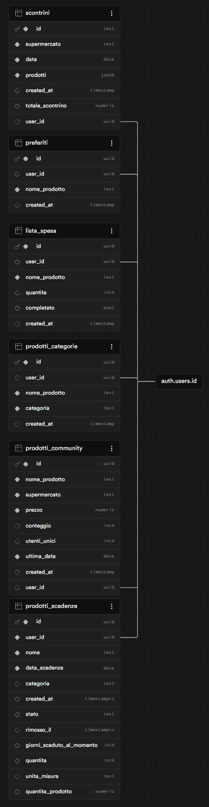

# CasaSmart

CasaSmart è un ecosistema di web app pensate per semplificare la gestione della spesa e della casa. Ogni app è un file HTML autonomo e condivide lo stesso progetto Supabase: autenticazione unica, database unico, account condiviso tra le due app.

---

## App disponibili

| App | File | Scopo |
|-----|------|-------|
| 🧾 ScontrinoSmart | `ScontrinoSmart.html`   | Digitalizza scontrini, confronta prezzi, gestisce la lista della spesa |
| ⏰ ScadenzeTracker | `ScadenzeTracker.html` | Traccia le scadenze dei prodotti alimentari |

---

## 🧾 ScontrinoSmart

ScontrinoSmart permette a ogni utente di digitalizzare gli scontrini della spesa, salvare i prodotti acquistati, confrontare i prezzi nel tempo e gestire una lista della spesa personale.

**Demo live:** [scontrinosmart.netlify.app](https://scontrinosmart.netlify.app/)

### Descrizione

L'app permette a ogni utente di accedere al proprio spazio personale tramite autenticazione e di salvare in modo ordinato i dati dei propri scontrini.

L'obiettivo del progetto è trasformare le informazioni presenti su uno scontrino in dati strutturati, consultabili e modificabili, così da poter monitorare gli acquisti, confrontare i prezzi dei prodotti e semplificare la gestione della spesa.

L'app include anche una schermata introduttiva visibile prima del login, pensata per spiegare in modo immediato le principali funzionalità disponibili e il valore del progetto per l'utente.

### Funzionalità principali

#### Accesso e presentazione iniziale
- Prima dell'autenticazione, l'app mostra una schermata introduttiva con una breve spiegazione delle principali funzionalità disponibili.
- La schermata iniziale presenta in modo sintetico le aree chiave del progetto: inserimento scontrini, confronto prezzi, prodotti preferiti e lista della spesa.
- Accesso personale per ogni utente, con gestione separata dei dati tramite account individuale.

#### Inserimento scontrini
- Aggiunta di un nuovo scontrino tramite JSON.
- Presenza di un prompt predefinito da copiare e usare su qualsiasi AI esterna.
- L'utente non carica la foto dello scontrino direttamente nell'app: la foto viene scattata o caricata su un servizio AI esterno, che restituisce un JSON strutturato da copiare e incollare successivamente in ScontrinoSmart.
- Possibilità di inserimento e revisione manuale dei dati.

#### Gestione prodotti
- Visualizzazione dei prodotti estratti dagli scontrini.
- Salvataggio di informazioni come nome prodotto, prezzo, prezzo scontato, quantità e prezzo per unità o per kg quando disponibile.
- Assegnazione automatica iniziale delle categorie tramite AI esterna, con possibilità di modifica completa da parte dell'utente.
- Modifica del nome del prodotto e della categoria in qualsiasi momento.

#### Modifica scontrino
- Apertura dello scontrino originale associato a un prodotto.
- Modifica di supermercato, data, totale e prodotti contenuti nello scontrino.
- Modifica dei prezzi, delle quantità e di altri dettagli dei prodotti.
- Aggiunta o rimozione manuale di prodotti all'interno dello scontrino.

#### Consultazione scontrini
- Visualizzazione dello storico degli scontrini salvati.
- Possibilità di filtrare gli scontrini per anno e mese, per rendere più semplice la consultazione dello storico.

#### Analisi prezzi
- Storico degli acquisti per prodotto.
- Confronto dei prezzi registrati nei diversi supermercati.
- Evidenza del prezzo minimo e massimo rilevato.
- Visualizzazione del miglior prezzo disponibile per prodotto.

#### Preferiti
- Sezione dedicata ai prodotti preferiti.
- Possibilità di salvare rapidamente i prodotti usati più spesso.

#### Lista della spesa
- Creazione di una lista della spesa personalizzata.
- Aggiunta manuale dei prodotti da acquistare.
- Collegamento dei prodotti salvati alla lista della spesa.
- Gestione della quantità e dello stato di completamento degli elementi.
- Suggerimento del supermercato più conveniente per alcuni prodotti presenti nella lista.

#### Dashboard iniziale
- Panoramica generale con: numero di scontrini salvati, spesa totale registrata, numero di prodotti unici, numero di supermercati presenti nello storico ed elenco degli ultimi scontrini inseriti.

### Flusso di utilizzo

1. L'utente apre l'app e visualizza una breve panoramica delle funzionalità principali.
2. Effettua il login.
3. Apre la sezione per aggiungere un nuovo scontrino.
4. Copia il prompt fornito dall'app.
5. Usa il prompt su un servizio AI esterno di sua scelta.
6. Scatta o carica lì la foto dello scontrino.
7. Ottiene un JSON strutturato.
8. Incolla il JSON nell'app.
9. Controlla, modifica e salva i dati estratti.
10. Consulta i prodotti, confronta i prezzi e aggiorna preferiti o lista della spesa.

### Uso dell'AI

L'app **non integra direttamente un modello AI** tramite API o servizi interni.

L'AI viene utilizzata solo in modo esterno al sistema: l'utente copia un prompt fornito dall'app, lo usa su un servizio AI di sua scelta, carica o fotografa lì lo scontrino e ottiene un JSON da incollare successivamente nell'app.

Questo approccio permette di sfruttare strumenti AI per l'estrazione e la prima strutturazione dei dati, mentre la gestione, il salvataggio e la modifica finale delle informazioni avvengono interamente all'interno dell'app.

---

## ⏰ ScadenzeTracker

ScadenzeTracker aiuta gli utenti a tenere traccia delle scadenze dei prodotti alimentari e non, con avvisi visivi e notifiche per prodotti in scadenza o già scaduti.

Condivide lo stesso progetto Supabase di ScontrinoSmart: chi è già registrato su una delle due app può accedere direttamente anche all'altra senza una nuova registrazione.

**Demo live:** [scontrinosmart.netlify.app](https://scadenzetracker.netlify.app/)

### Funzionalità principali

#### Tab Prodotti — schermata principale
- Form di inserimento con: nome, data scadenza, categoria, numero di pezzi, quantità prodotto e unità di misura (gr / kg / lt / ml / pz).
- **Classificazione automatica della categoria** — al blur del campo nome, una funzione locale basata su centinaia di parole chiave seleziona automaticamente la categoria più adatta, senza chiamate API esterne. Accanto alla label appare un badge `✦ auto`. La categoria può essere modificata manualmente in qualsiasi momento.
- **4 contatori colorati** aggiornati in tempo reale: Scaduti / Scadenza entro 3 giorni / Scadenza entro 7 giorni / Oltre 7 giorni.
- Lista prodotti ordinata per data di scadenza, con card colorate in base allo stato.
- **Doppio filtro combinato:** una prima riga di chip filtra per stato di scadenza (tutti / scaduti / 3gg / 7gg / ok), una seconda filtra per categoria (15 categorie con emoji). I due filtri si combinano — è possibile vedere, ad esempio, solo i Latticini in scadenza entro 3 giorni.
- Sui prodotti già scaduti: bottone archivio (sposta in storico) e bottone elimina definitivo.
- **Archiviazione automatica** dopo 14 giorni dalla scadenza, all'apertura dell'app.

#### Tab Storico
- Top 5 prodotti più scaduti con barra proporzionale.
- Lista completa dei prodotti archiviati con: data rimozione, giorni di ritardo alla rimozione (verde / arancione / rosso), categoria e quantità.

#### Notifiche in-app
- **Banner al login** — ogni volta che si apre l'app, un banner colorato appare in cima alla lista prodotti. Mostra una riga rossa per i prodotti già scaduti (con i nomi) e una arancione per quelli in scadenza entro 3 giorni. Ogni riga ha una X per chiuderla.

#### Web Push
- Al primo accesso, un modal overlay chiede il permesso per le notifiche di sistema.
- Funziona su desktop; su mobile richiede che l'app sia servita via HTTPS (es. Netlify).

#### Tab Impostazioni
- Toggle on/off per le notifiche push.
- Riga di stato che mostra se le notifiche sono Attive / Disattive / Bloccate dal browser.
- Sezione account con email dell'utente e bottone logout.

---

## Stack tecnico

- HTML / CSS / JavaScript puro, nessun framework
- **Supabase** per autenticazione e database (progetto condiviso tra le due app)
- **Netlify** per il deploy del frontend
- Tabler Icons + DM Sans / DM Mono via CDN

---

## Autenticazione

- Login e registrazione con email/password tramite Supabase Auth.
- **Account condiviso** tra ScontrinoSmart e ScadenzeTracker: stesso progetto Supabase, sessione persistente.
- Row Level Security attiva su tutte le tabelle: ogni utente vede esclusivamente i propri dati.

---

## Database

L'app utilizza Supabase come backend per la gestione dei dati e dell'autenticazione.

### Tabelle di ScontrinoSmart
- `scontrini` → contiene supermercato, data, totale e prodotti associati allo scontrino.
- `preferiti` → memorizza i prodotti preferiti dell'utente.
- `lista_spesa` → salva i prodotti da acquistare, con quantità e stato di completamento.
- `prodotti_categorie` → associa i prodotti alle categorie personalizzate.
- `prodotti_community` → raccoglie informazioni sui prodotti e sui prezzi registrati.

### Tabelle di ScadenzeTracker
- `prodotti_scadenze` → colonne: `id`, `user_id`, `nome`, `data_scadenza`, `categoria`, `stato` (`attivo` / `scaduto_eliminato` / `eliminato`), `rimosso_il`, `giorni_scaduto_al_momento`, `quantita` (default 1), `quantita_prodotto`, `unita_misura` (gr / kg / lt / ml / pz), `created_at`.

Tutte le tabelle sono collegate all'utente tramite `user_id`, con riferimento al sistema di autenticazione di Supabase.

---

## Design

Entrambe le app condividono lo stesso sistema visivo:
- Tema scuro con `background: #0f0f0f` e accent viola `#6C63FF`.
- Schermata di login con feature card introduttive e card "Account condiviso" che menziona entrambe le app.

---

## Stato del progetto

Il progetto è in continuo sviluppo. Nuove funzionalità, miglioramenti all'interfaccia e ottimizzazioni al database vengono rilasciati progressivamente.

---

## Nota sullo sviluppo

Questo progetto è stato ideato, costruito e migliorato con il supporto dell'AI.

L'AI è stata utilizzata come strumento di supporto durante lo sviluppo: nella generazione di idee, nel debugging, nella scrittura e revisione di parti del codice e nella definizione di alcune soluzioni implementative.

Le scelte progettuali, l'adattamento delle funzionalità, le modifiche finali e l'organizzazione complessiva del progetto sono state gestite direttamente dall'autore.
